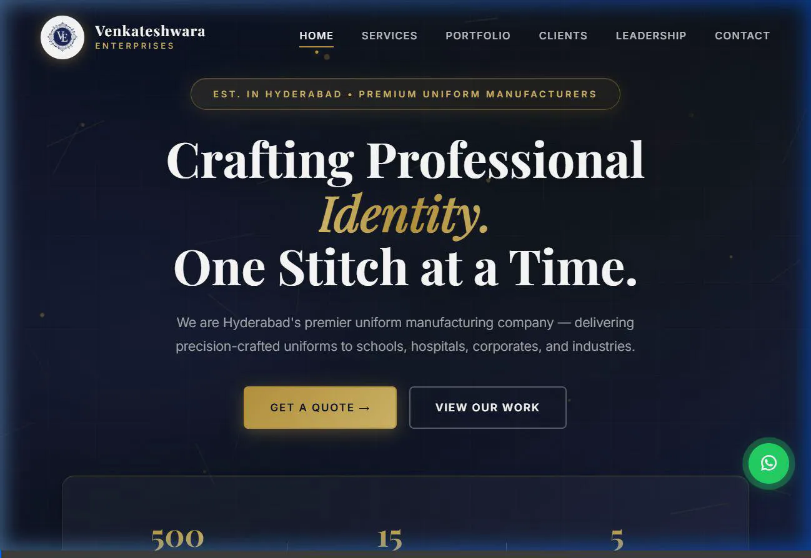

# Venkateshwara Enterprises — Premium Uniform Manufacturers


**Hyderabad's Premier Uniform Manufacturing Company** — delivering precision-crafted uniforms to schools, hospitals, corporates, and industries for over 20 years.

## 🌐 [View Live Website →](https://venkateshwaraenterprises.netlify.app/)

---

## 🎬 Website Walkthrough



---

## 👔 About Venkateshwara Enterprises

**Venkateshwara Enterprises** has been serving Hyderabad for 20+ years, providing premium uniforms to:

- ✈️ **GMR International Airports** & Delhi International Airport
- 🏥 **Oliva Clinics** & Healthcare institutions
- 🏫 **Laurus School**, VNR Vignana Jyothi Institute, Zaamin Group of Schools
- 🏢 Corporate clients like **Deloitte**, **Techolution**, and more
- 🏭 Industrial clients across Telangana

**Certifications:**
- ISO 9001:2015 Quality Management
- GMP Certified (Good Manufacturing Practice)
- MSME Registered & Udyam Certified

---

## ✨ Features

- 🎬 **Cinematic Splash Intro** — Premium brand-reveal animation on page load
- 🧵 **Canvas Fabric Threads** — Subtle floating thread particles in the hero (fabric-manufacturing vibe)
- ✨ **Shimmer Gold Typography** — Animated gradient text effects
- 📊 **Scroll Progress Bar** — Gold progress indicator tracking scroll position
- 🃏 **3D Interactive Cards** — Service cards with tilt & light-sweep hover effects
- 🧭 **Smart Navigation** — Active section highlighting with gold indicators
- 🖱️ **Mouse Parallax** — Depth-creating parallax effect in the hero section
- ⌨️ **Typewriter Effect** — Dynamic text animation on hero subtitle
- � **Contact Form Integration** — Powered by Formspree for instant inquiries
- �📱 **Fully Responsive** — Optimized for all devices and screen sizes
- ♿ **Accessible** — Respects `prefers-reduced-motion` preferences

---

## 🏗️ Tech Stack

| Technology | Usage |
|-----------|-------|
| HTML5 | Structure & semantics |
| CSS3 | Animations, glassmorphism, 3D transforms |
| Vanilla JS | Interactivity, canvas particles, IntersectionObserver |
| Formspree | Form submission handling |
| Netlify | Hosting & deployment |
| Font Awesome | Icons |
| Google Fonts | Playfair Display + Inter |

---

## 📂 Project Structure
```
VE-main/
├── index.html          # Main website page
├── style.css           # All styling + animations
├── main.js             # Interactivity + visual effects
└── assets/
    ├── logo.png        # VE monogram logo
    ├── walkthrough.webp # Website walkthrough video
    ├── md-nagaraju.jpg  # Leadership photo
    ├── proprietor-deepa.jpg
    ├── dhruva-sai.jpg   # Developer photo
    └── works/          # Portfolio images
        ├── blazer.jpg
        ├── laurus-pinafore.jpg
        ├── techolution-bag.jpg
        ├── deloitte-cap.jpg
        └── ... (more portfolio items)
```

---

## 🚀 Getting Started

### Prerequisites
- A modern web browser (Chrome, Firefox, Safari, Edge)
- Optional: Live Server extension for VS Code

### Installation

1. Clone the repository:
```bash
   git clone https://github.com/DHRUVASAI/VE.git
```

2. Navigate to the project folder:
```bash
   cd VE
```

3. Open `index.html` in your browser, or use Live Server in VS Code for live reload.

---

## 🤖 Built With AI

This project was developed using AI-assisted workflows:

- **Claude Opus 4.6** — Design architecture, code generation, and problem-solving
- **Gemini 3** — Cross-validation, optimization, and alternative approaches

*Demonstrating modern development workflows where AI tools amplify human creativity and business understanding.*

---

## � Key Sections

### 🏠 Hero Section
Premium intro with animated typography, fabric particles, and mouse parallax effects

### 🛠️ Services
8+ specialized categories:
- Industrial Uniforms
- Healthcare Wear
- School Uniforms
- Corporate Apparel
- Bags & Backpacks
- Caps & Headwear
- Jackets & Rainwear
- Custom Solutions

### 🖼️ Portfolio
Real client work showcasing:
- Aradhana Academy Blazers
- Laurus School Pinafores
- Techolution Corporate Bags
- Deloitte Branded Caps
- And more...

### 🤝 Trusted Clients
GMR Airports, IIRM Hyderabad, Oliva Clinics, Naandi Foundation, and 200+ more

### 👥 Leadership
- **Vudatha Nagaraju** — Managing Director (20+ years experience)
- **Vudatha Deepa** — Proprietor (Operations & Quality)

---

## �📞 Contact

**Venkateshwara Enterprises**

📍 H.No: 5-5-35/214, 2nd Floor  
Above Sree Sai Cutting Tools  
Prashanth Nagar, Shakthi Peetam  
Kukatpally, Hyderabad - 500072  
Telangana, India

📱 **Phone:**  
- +91 70131 07335  
- +91 99512 11704

📧 **Email:** Vnagaraju@venkateshwaraenterprises.net

🌐 **Website:** [venkateshwaraenterprises.netlify.app](https://venkateshwaraenterprises.netlify.app/)

---

## 👨💻 Developer

**Vudatha Dhruva Sai**  
Computer Science Engineering Student  
KL University, Hyderabad (KLH)

[](https://www.linkedin.com/in/vudatha-dhruva-sai-500217315/)
[](https://github.com/DHRUVASAI)

---

## 🎯 Project Goals

This website was built to:
1. ✅ Establish professional online presence for a 20+ year-old business
2. ✅ Showcase portfolio and certifications to potential clients
3. ✅ Generate leads through contact form integration
4. ✅ Build credibility with modern, polished design
5. ✅ Demonstrate AI-assisted development capabilities

---

## 🚧 Roadmap

- [ ] Migrate to custom domain (`venkateshwaraenterprises.com`)
- [ ] Add customer testimonials section
- [ ] Implement WhatsApp Business integration
- [ ] Create product catalog with pricing
- [ ] Add blog section for company updates
- [ ] Multi-language support (English/Telugu)

---

## � License

This project is licensed under the MIT License - see below for details.

**Note:** All brand assets, logos, client information, and product images are property of Venkateshwara Enterprises and used with permission.

---

## 🙏 Acknowledgments

- **Venkateshwara Enterprises** — For 20+ years of quality service
- **Claude (Anthropic)** & **Gemini (Google)** — AI development assistance
- **Netlify** — Free hosting and deployment
- **Formspree** — Contact form handling
- **Font Awesome** — Icon library
- **Google Fonts** — Typography

---

## 💡 Lessons Learned

Building this project taught me:
- How to translate business requirements into web experiences
- Effective collaboration with AI tools for rapid development
- The importance of user experience in B2B websites
- Real-world deployment and form integration
- Balancing aesthetics with performance

---

<div align="center">

**Made with ❤️ for family business | Powered by AI | Deployed on Netlify**

[](https://venkateshwaraenterprises.netlify.app/)

© 2026 Venkateshwara Enterprises. All Rights Reserved.

</div>
